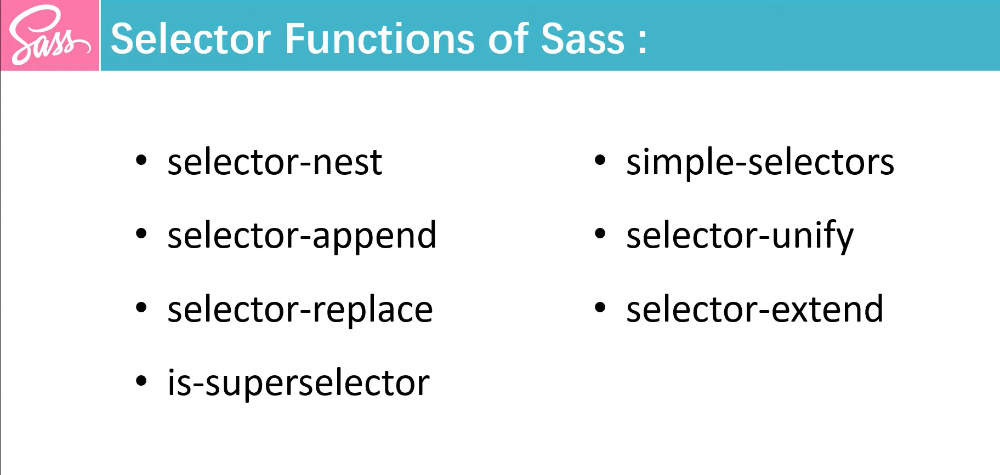
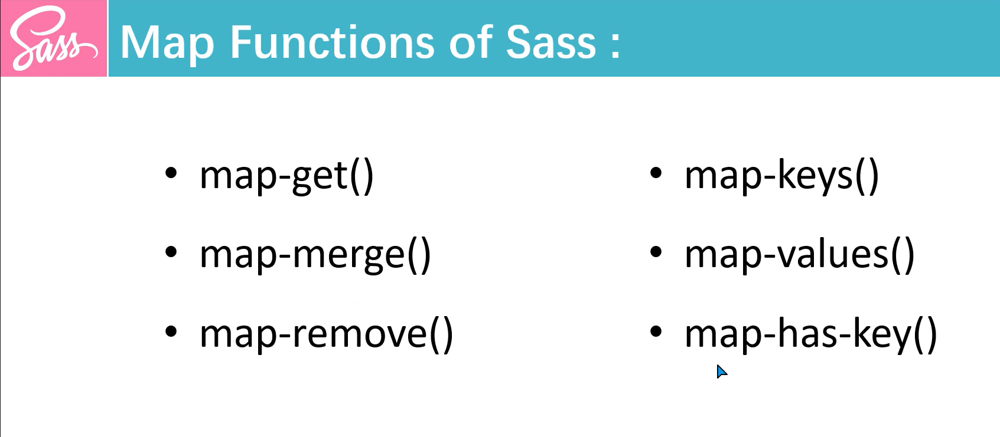
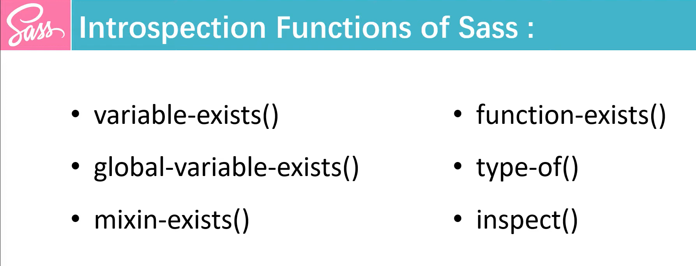

# Sass Function
Functions in Sass can take arguments, perform operations, and return a value.
### Basic Syntax
* `@function`: Keyword to define a function.
* `function-name`: The name of the function.
* `$arg1, $arg2, ...`: Arguments passed to the function.
`@return`: The value that the function returns.
```scss
@function function-name ($arg1, $arg2, $arg3) {
  // Function Logic Here !
  @return some-value;
}
```
## Sass Number Functions
Sass **(Syntactically Awesome Style Sheets)** offers a variety of number functions that allow you to perform arithmetic and manipulate numbers directly within your stylesheets.
### 1. abs($number)
Returns the absolute value of a number.
```scss
.test{content: abs(-5)} // Return 5
.test{content: abs(3.5)} // Return 3.5
```
### 2.ceil($number)
Rounds a number **up** to the nearest whole number.
```scss
.test{content: ceil(4.2)} // Return 5
.test{content: ceil(-3.5)} // Return -3
```
### 3.floor($number)
Rounds a number **down** to the nearest whole number.
```scss
.test{content: floor(4.2)} // Return 4
.test{content: floor(-4.8)} // Return -5 
```
### 4. round($number)
Rounds a number to the nearest whole number.
```scss
.test{content: floor(4.2)} // Return 4
.test{content: floor(4.6)} // Return 5
```
### 5. min($number...)
Returns the **smallest** number from a list of numbers.
```scss
.test{content: min(5, 2, 8, -3)} // Return -3
```
### 6. max($number...)
Returns the **largest** number from a list of numbers.
```scss
.test{content: max(5, 2, 8, -3)} // Return 8
```
### 7. random($limit: null)
Generates a random number. If `$limit` is provided, it returns a random integer between `1` and `$limit;` otherwise, it returns a random number between `0 and 1`.
```scss
.test{content: random()} // Random number between 0 and 1
.test{content: random(10)} // Random number between 1 and 10
```
### 8. percentage($number)
Converts a number to a **percentage**.
```scss
.test{content: percentage(0.5)} // Return 50%
```
### 9. unit($number)
Returns the **unit** of a number.
```scss
.test{content: unit(10)} // Return ""
.test{content: unit(10rem)} // Return rem
```
### 10. unitless($number)
Returns whether a number has no unit.
```scss
.test{content: unitless(10)} // Return true
.test{content: unitless(10px)} // Return false
```
### 11. comparable($number1, $number2)
Returns whether two numbers can be compared. Two numbers are comparable if they have the same units or are both unitless.
```scss
.test{content: comparable(10, 5)} // Return true
.test{content: comparable(10px, 5em)} // Return false
.test{content: comparable(10px, 5px)} // Return true
```

## Sass String Functions
Sass **(Syntactically Awesome Style Sheets)** provides several string functions that can help you manipulate and format strings in your stylesheets. 
### 1. quote($string)
Adds **quotes** around a string.
```scss
.test{content: quote(hello world)} // Return "hello world"
```
### 2. unquote($string)
**Removes quotes** from a string.
```scss
.test{content: unquote("Hello World")} // Return Hello World
```
### 3. str-length($string)
Returns the **number of characters** in a string.
```scss
.test{content: str-length("Hello World")} // Return index number 11
```
### 4. str-insert($string, $insert, $index)
**Inserts a substring** into a string at a specified index.
```scss
.test{content: str-insert("Hello World", " Beautiful", 7)} // Return Hello Beautiful World
```
### 5. str-index($string, $substring)
Returns the **index** of the first occurrence of a substring within a string. Returns null if the substring is not found.
```scss
.test{content: str-index("Hello World", "World")} // Return 7
```
### 6. str-slice($string, $start-at, [$end-at])
**Extracts** a substring from a string, starting at a specified index. Optionally, you can specify an end index.
```scss
.test{content: str-slice("hello world", 1, 5)}; // "hello"
```
### 7. to-upper-case($string)
Converts all characters in a string to **uppercase**.
```scss
.test{content: to-upper-case("hello world")} // Return HELLO WORLD  
```
### 8. to-lower-case($string)
Converts all characters in a string to **lowercase**.
```scss
.test{content: to-upper-case("Hello World")} // Return hello world
```
### 9. unique-id()
Generates a **unique** CSS identifier.
```scss
.test{content: unique-id()} // Return an unique id
```

## Sass Color Functions
Sass **(Syntactically Awesome Style Sheets)** provides a set of powerful color functions that allow you to manipulate and adjust colors in various ways. 
### 1. arken($color, $amount)
Decreases the lightness of a color, making it **darker**.
```scss
$base-color: #3498db; // A shade of blue
$darker-color: darken($base-color, 10%); // Darkens the color by 10%
```
### 2. lighten($color, $amount)
Increases the lightness of a color, making it **lighter**.
```scss
$lighter-color: lighten($base-color, 10%); // Lightens the color by 10%
```
### 3. adjust-hue($color, $degrees)
Changes the hue of a color by a specified degree.
```scss
$new-hue-color: adjust-hue($base-color, 45deg); // Adjusts hue by 45 degrees
```
### 4. saturate($color, $amount)
Increases the saturation of a color, making it more **vivid**.
```scss
$saturated-color: saturate($base-color, 20%); // Increases saturation by 20%
```
### 5. desaturate($color, $amount)
Decreases the saturation of a color, making it more **muted**.
```scss
$desaturated-color: desaturate($base-color, 20%); // Decreases saturation by 20%
```
### 6. rgba($color, $alpha)
Converts a color to an rgba color with a specified alpha (opacity) level.
```scss
$transparent-color: rgba($base-color, 0.5); // Sets 50% opacity
```
### 7. mix($color1, $color2, $weight)
Mixes two colors together in a specific proportion.
```scss
$mixed-color: mix($color1, $color2, 50%); // Mixes colors evenly
```
### 8. transparentize($color, $amount) / fade-out($color, $amount)
Decreases the opacity of a color.
```scss
$transparent-color: transparentize($base-color, 0.3); // Makes color 30% more transparent
```

## Sass Selector Functions
The `selector` function in Sass is used to manipulate and work with selectors in CSS. It provides ways to split, append, or manipulate selectors in your stylesheets.


### Basic Usage of `selector` Functions
1. `selector-nest()`: Nests selectors together as if they were written in a nested Sass block.
2. `selector-append()`: Appends one or more selectors to the end of another selector.
3. `selector-extend()`: Extends a selector using another selector (similar to @extend).
4. `selector-replace()`: Replaces a selector with another selector within a given selector list.
5. `selector-unify()`: Unifies two selectors, combining them if possible.
6. `simple-selectors()`: Returns a list of simple selectors within a compound selector.
7. `is-superselector()`: Returns whether a selector is a superselector of another selector.

### 1. selector-nest()
The `selector-nest()` function takes multiple selectors and nests them as you would in a Sass block.
```scss
$nested: selector-nest(".parent-element", ".child-element");
// Return : .parent-element .child-element{}
```
### 2. selector-append()
The `selector-append()` function adds additional selectors to the end of an existing selector.
```scss
$append: selector-append(".btn", ":hover");
// Return : .btn:hover{}
```
### 3. selector-extend()
The `selector-extend()` function extends a selector with another selector.
```scss
$extend: selector-extend(".base",".new");
// Return : .new, .base {} 
```
### 4. selector-replace()
The `selector-replace()` function replaces a part of a selector with another selector.
```scss
$replaced: selector-replace('.old .child', '.child', '.new');
// Return : .old .new {}
```
### 5. selector-unify()
The `selector-unify()` function combines two selectors if possible.
```scss
$unified: selector-unify('.foo', '.bar');
// Return : .foo.bar{}
```
### 6. simple-selectors()
The `simple-selectors()` function returns a list of simple selectors from a compound selector.
```scss
$simple: simple-selectors('.foo.bar.baz');
// Return : .foo, .bar, .baz {}
```
### 7. is-superselector()
The `is-superselector()` function checks if one selector is a superselector of another.
```scss
$is_super: is-superselector('.parent', '.parent .child');
// Return : This would return true because .parent is a superselector of .parent .child.
```

## Sass Map Functions
Sass **maps** are a powerful feature that allows you to store pairs of keys and values, similar to dictionaries in other programming languages.


They are particularly useful for managing complex collections of **variables**, such as **theme colors**, **font sizes**, or **breakpoints**.

### Key Function for Working with Sass Maps
* `map-get($map, $key)`: Retrieves the value associated with a specific key in the map.
* `map-merge($map1, $map2)`: Combines two maps into a new map.
> NOTE:  If both maps have the same key, the value from the second map will overwrite the value from the first map.
* `map-remove($map, $key...)`: Removes one or more keys from the map.
* `map-keys($map)`: Returns a list of all keys in the map.
* `map-values($map)`: Returns a list of all values in the map.
* `map-has-key($map, $key)`: Checks if a map contains a specific key.

## Sass Inrospection Functions
