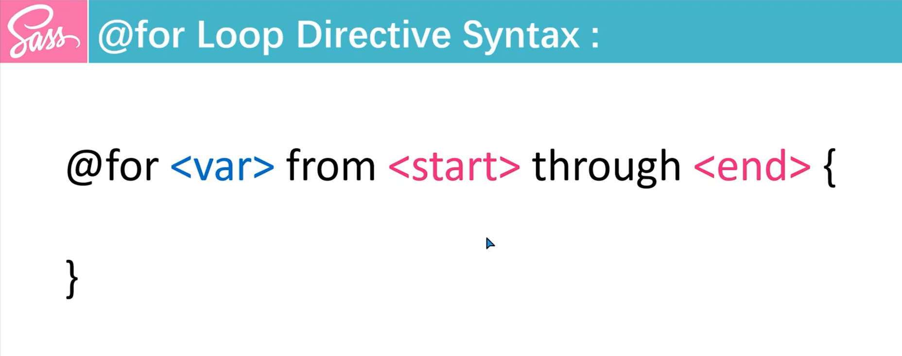

## Sass @for Directive
The `@for` directive in Sass is a loop that allows you to iterate over a range of numbers and generate styles dynamically.
```scss
// Syntex
@for $var from 1 through 3 {
    // Styles Here
}
```


* `$var`: A variable that holds the current value in the loop.
* from `<start>`: The starting point of the loop.
* through `<end>`: The ending point of the loop, inclusive of the end value.
* Alternatively, you can use `to` instead of `through` if you don't want to include the end value.

### Example 1: Using @for with through
```scss
@for $var from 1 through 3 {
    .column-#{$var} {
        width: #{$var * 20}%;
    }
}
```
In this example, the loop generates three classes (.column-1 to .column-3), with each having a different width property based on the loop iteration.

### Example 2: Using @for with to
```scss
@for $var from 1 to 4 {
    .item-#{$var} {
        margin-left: #{$var * 10}px;
    }
}
```
Here, the loop runs from 1 to 3 (since to excludes the end value 4), creating classes .item-1 through .item-3