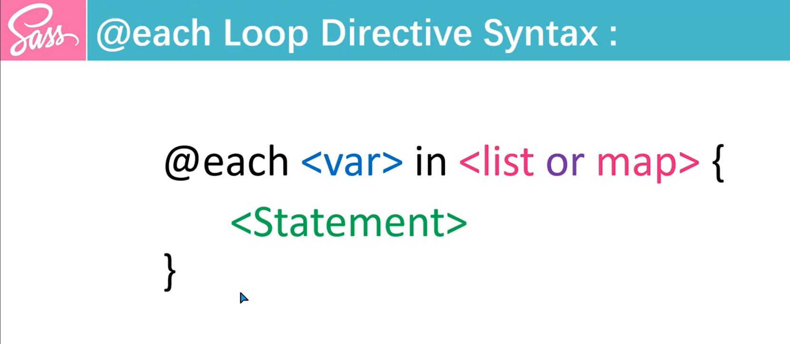

## Sass @each Directive
The `@each` directive in Sass is a control directive that allows you to loop through a list, map, or other iterable structures and apply styles for each item in the collection.

### @each Directive Syntax

```scss
@each $variable in <list or map> {
    // statements here
}
```

### Looping through a List
```scss
$colors: red, blue, green;

@each $color in $colors {
  .text-#{$color} {
    color: $color;
  }
}
```

### Looping through a Map
```scss
$sizes: (small: 10px, medium: 20px, large: 30px);

@each $name, $size in $sizes {
  .box-#{$name} {
    width: $size;
    height: $size;
  }
}
```

### Using @each with Nested Loops
```scss
$colors: red, blue, green;
$sizes: small, medium, large;

@each $color in $colors {
  @each $size in $sizes {
    .box-#{$color}-#{$size} {
      background-color: $color;
      font-size: $size;
    }
  }
}
```

### Key Concepts:
* Interpolation (`#{}`): This is used to combine a variable into a CSS selector.
* Lists and Maps: You can loop through both types of collections.
* Variable Scope: The variables inside the `@each` block only exist inside that block.