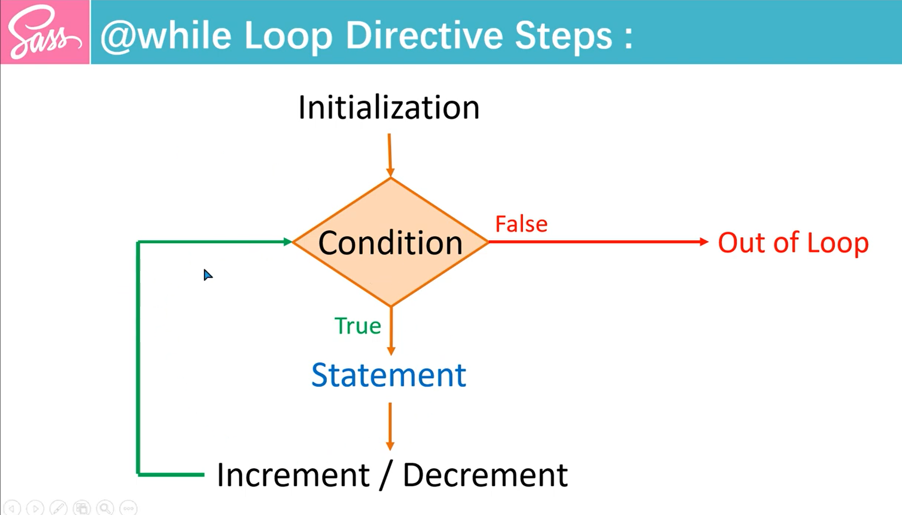
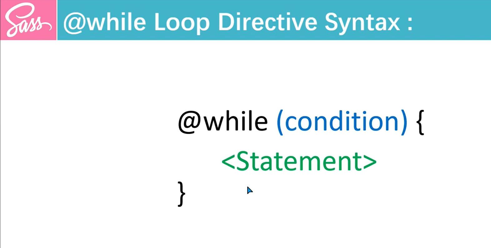

## Sass @while Directive
The `@while` directive in Sass is a control directive that allows you to run a loop as long as a specified condition evaluates to true.



### Basic Syntax:

```scss
@while $condition {
  // code here
}
```

### Basic @while Loop
```scss
$i: 1;

@while $i <= 5 {
  .margin-#{$i} {
    margin: $i * 10px;
  }
  $i: $i + 1;
}
```
In this example, the loop will iterate while `$i` is less than or equal to 5. After each iteration, the value of `$i` is incremented by 1.

### Key Points:
* **Condition-Driven:** The loop runs while the condition is true.
* **Variable Updates:** Make sure you increment or change your loop variables inside the block; otherwise, you could create an infinite loop.
* **Dynamic Output:** The output changes dynamically based on the value of the loop variable, useful for generating repeated styles.